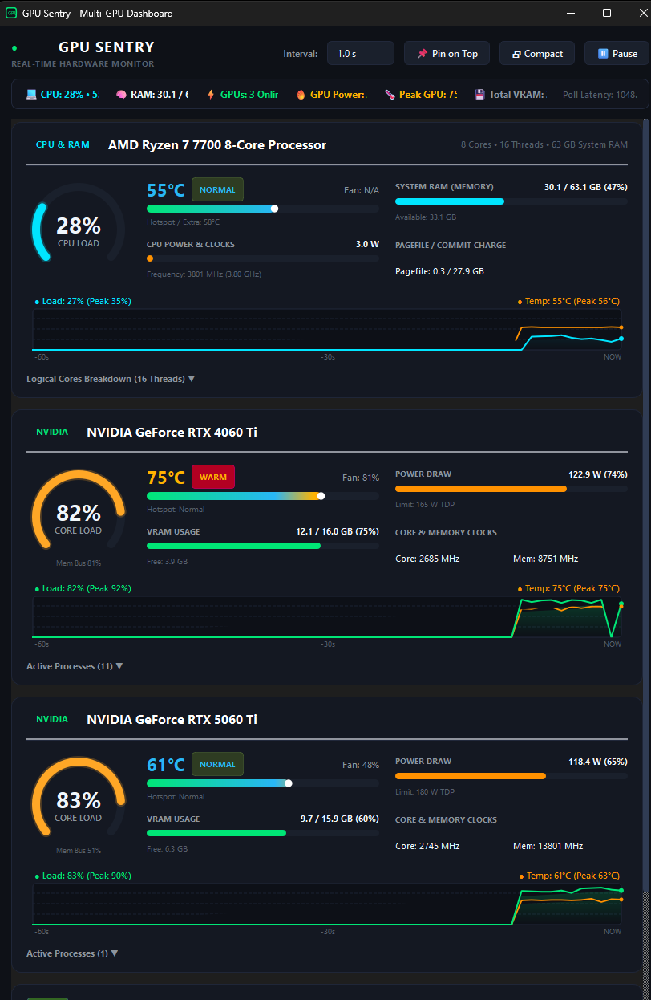

# GPU & System Sentry ⚡

A high-performance, lightweight, modern cross-platform (**Windows & Linux**) desktop telemetry dashboard providing near real-time telemetry for **CPU, System RAM, and all GPUs** simultaneously in one unified interface.

Built specifically for multi-GPU setups (e.g., dual NVIDIA GeForce RTX + AMD Radeon Graphics / APU / Intel Arc) alongside AMD Ryzen / Intel Core processors.



---

## ✨ Key Features

- **💻 CPU Telemetry**:
  - Processor model detection (e.g. `AMD Ryzen 7 7700 8-Core Processor` via Windows Registry or Linux `/proc/cpuinfo`).
  - Core & thread specification (`8 Cores • 16 Threads`).
  - Real-time overall CPU Core Load percentage with radial arc gauge.
  - Core Clock frequency (MHz / GHz).
  - CPU Package Temperature (°C) with dynamic thermal safety status (via ADL on Windows, kernel `hwmon` / `k10temp` / `coretemp` on Linux).
  - CPU Power consumption in Watts.
  - Expandable **Logical Cores Breakdown**: live bar graph for every thread (`T00` through `T15+`).
- **🧠 System RAM (Memory) Telemetry**:
  - Live Used / Total System RAM (e.g., `29.6 / 63.1 GB (47%)`).
  - Available / Free system RAM.
  - Pagefile / Swap space tracking (`Used / Total GB`).
- **⚡ Multi-GPU Monitoring in One Dashboard**:
  - Automatically discovers and displays all physical GPUs side by side:
    - **NVIDIA GeForce RTX 4060 Ti**
    - **NVIDIA GeForce RTX 5060 Ti**
    - **AMD Radeon™ Graphics**
    - Support for Intel Arc / UHD adapters.
- **🏎️ Ultra-Lightweight & Near Zero CPU Overhead (~0.0% CPU)**:
  - Direct in-process C-level hardware queries using native `nvml.dll` / `libnvidia-ml.so`, `atiadlxx.dll`, DXGI, and Linux DRM sysfs via `ctypes`.
  - **No external heavy runtimes** or slow subprocess spawning (like polling `nvidia-smi` in loops).
  - Background queries run in < 1 millisecond on a dedicated asynchronous `QThread`.
- **🌡️ Comprehensive Thermal Telemetry**:
  - Core Temperatures (°C) for CPU and all GPUs.
  - Dynamic thermal safety badges: `COOL` (<55°C), `NORMAL` (55-67°C), `WARM` (68-77°C), `HOT` (78-85°C), `THROTTLE` (≥86°C).
  - Hotspot / Junction / SoC Temperatures.
  - Thermal gradient indicator bars with live needles.
  - Fan Speed (%) & Fan RPM.
- **📊 Real-Time Rolling History Graphs**:
  - Smooth antialiased 60-second rolling sparklines showing both **Core Load (%)** and **Temperature (°C)** simultaneously for CPU and every GPU.
  - Live Peak and Min indicators.
- **💾 VRAM & Power Telemetry**:
  - Dedicated and shared VRAM usage (GB used / Total GB, percentage, free VRAM).
  - Real-time power draw in Watts, power limits (TDP), and percentage.
  - Real-time Core Clock (MHz) and Memory Clock (MHz).
- **📋 Active GPU Workloads Drawer**:
  - Expandable drawer per GPU displaying active compute and graphics processes (e.g. `llama-server.exe`, `whisper-server.exe`, web browsers) with PID.
- **📊 Taskbar Widget (Docked near Clock)**:
  - Sleek, unobtrusive live telemetry widget docked directly on the Windows taskbar next to the notification tray and clock.
  - Displays real-time **CPU (Load & Temp)**, **Active GPU (Load & Temp)**, **System RAM**, and **GPU Power (Watts) / VRAM**.
  - **4 Distinct Display Layouts**:
    - **Compact (2 Rows - Default)**: Dual-line grid with CPU, RAM, GPU, and Power/VRAM.
    - **Slim (1 Row)**: Ultra-minimalist horizontal single-line ticker (`CPU • GPU • RAM`).
    - **Micro Load Bars**: Miniature glowing progress meters beneath CPU & GPU metrics.
    - **Multi-GPU Strip**: Live side-by-side stats for all detected physical GPUs (`G0`, `G1`).
  - **Auto-Dock to Clock**: Automatically snaps to the left of the notification area / taskbar clock.
  - **Draggable & Lockable**: Drag anywhere along the taskbar or desktop, with right-click position locking.
  - **Zero Focus Stealing**: Windows extended styles (`WS_EX_NOACTIVATE` & `WS_EX_TOOLWINDOW`) ensure it never interrupts games, typing, or Alt+Tab.
  - **Double-Click Shortcut**: Double-click to instantly bring up the full dashboard.
  - **Dynamic System Tray Icon**: Real-time colored temperature badge drawn dynamically onto the system tray icon (e.g. `71°` in green/amber/red).
- **🖥️ Modern Desktop UX**:
  - Windows 11 Fluent dark theme styling with glowing neon accents.
  - **Pin on Top**: Keep the monitor floating above games, benchmarks, or training runs.
  - **Compact Mode**: Collapse sparklines and drawers into an ultra-compact mini widget.
  - **Refresh Rate Control**: Choose between 500 ms, 1.0 s, 2.0 s, or 3.0 s polling intervals.
  - **Seamless Background Running**: Closing the main window (`X`) minimizes to the system tray and taskbar widget so stats keep updating uninterrupted. Use `Exit` from tray or widget menu to quit.

---

## 🚀 Quick Start

### 🪟 Windows Setup

#### 1. Instant Launch
Double-click `run.bat` in the project root:
```bat
run.bat
```

#### 2. Manual Python Launch
```powershell
.\.venv\Scripts\python.exe main.py
```

---

### 🐧 Linux Setup

GPU & System Sentry supports all major Linux distributions (Ubuntu, Debian, Fedora, Arch Linux, openSUSE) with Wayland or X11 desktop environments (GNOME, KDE Plasma, XFCE).

#### 1. Install System Dependencies

Make sure Python 3.10+ and standard Qt6 runtime libraries are installed:

- **Ubuntu / Debian / Pop!_OS / Linux Mint**:
  ```bash
  sudo apt update
  sudo apt install -y python3 python3-pip python3-venv libgl1 libegl1 libxkbcommon-x11-0 libxcb-cursor0
  ```

- **Fedora / RHEL / CentOS Stream**:
  ```bash
  sudo dnf install -y python3 python3-pip libglvnd-glx libglvnd-egl libxkbcommon-x11 xcb-util-cursor
  ```

- **Arch Linux / Manjaro / EndeavourOS**:
  ```bash
  sudo pacman -S --needed python python-pip qt6-base
  ```

- **openSUSE Tumbleweed / Leap**:
  ```bash
  sudo zypper install -y python3 python3-pip libglvnd libxkbcommon-x11-0
  ```

> [!NOTE]
> - **NVIDIA GPUs**: Proprietary NVIDIA graphics drivers provide `libnvidia-ml.so.1` automatically. Ensure drivers are installed (e.g., `sudo apt install nvidia-driver-550` or distro equivalent).
> - **AMD & Intel GPUs**: Kernel DRM/hwmon sysfs interfaces (`amdgpu` / `i915` / `xe`) are utilized natively without needing extra SDKs.

#### 2. Instant Launch with `run.sh`

A convenient shell script is included that sets up the virtual environment, installs dependencies, and launches the app:
```bash
chmod +x run.sh
./run.sh
```

#### 3. Manual Python Launch

```bash
# Create and activate virtual environment
python3 -m venv .venv
source .venv/bin/activate

# Install requirements
pip install -r requirements.txt

# Run dashboard
python main.py
```

---

## 💡 Tips & Desktop Integration

### 🪟 Windows Taskbar Widget
- **Dock Next to Clock**: Right-click the taskbar widget and select **`📌 Dock Next to Clock`** to automatically re-center the widget directly adjacent to the Windows notification tray.
- **Drag & Reposition**: Click and drag the widget anywhere on the taskbar or desktop. When dragging near the taskbar bottom, it magnetically snaps into place. Right-click and choose **`🔒 Lock Position`** to freeze it in place.
- **Display Modes**: Right-click the widget to switch between **Compact (2 Rows)**, **Slim (1 Row)**, **Micro Load Bars**, or **Multi-GPU Strip**.
- **Secondary Metric**: Switch the right column between **GPU Power (Watts)**, **Dedicated VRAM (GB)**, or **VRAM Usage (%)**.
- **Double-Click**: Double-click the widget at any time to open or focus the main GPU Sentry window.

### 🐧 Linux Wayland & System Tray
- **GNOME Shell System Tray**: On GNOME, install the [AppIndicator and KStatusNotifierItem Support](https://extensions.gnome.org/extension/615/appindicator-support/) GNOME extension so system tray icons appear in the top bar.
- **KDE Plasma & XFCE**: System tray icons and floating tool windows work natively out of the box.
- **Wayland vs X11**: If your Wayland compositor has issues positioning tool windows, you can force XWayland or native Wayland via environment variable:
  ```bash
  # Force X11 / XWayland
  QT_QPA_PLATFORM=xcb python main.py

  # Force native Wayland
  QT_QPA_PLATFORM=wayland python main.py
  ```

---

## 🏗️ Architecture

```
gpu_moni/
├── core/
│   ├── gpu_types.py          # Data classes (HostMetrics, CpuMetrics, RamMetrics, GpuDevice, GpuMetrics)
│   ├── host_backend.py       # Cross-platform CPU & RAM telemetry (hwmon, psutil, ADL)
│   ├── nvml_backend.py       # Direct C ctypes wrapper for NVIDIA nvml.dll / libnvidia-ml.so
│   ├── adl_backend.py        # Direct C ctypes wrapper for AMD atiadlxx.dll / ADL2 PMLog
│   ├── dxgi_backend.py       # DXGI adapter enumerator & PDH memory counters (Windows)
│   └── monitor_worker.py     # Asynchronous QThread background telemetry engine (Windows & Linux)
├── ui/
│   ├── theme.py              # Dark cyberpunk / Fluent modern QSS & palette
│   ├── widgets/
│   │   ├── taskbar_widget.py # Floating/dockable taskbar telemetry widget next to clock
│   │   ├── cpu_ram_card.py   # Dedicated CPU & RAM card with per-thread breakdown
│   │   ├── gpu_card.py       # Responsive individual GPU telemetry card
│   │   ├── arc_gauge.py      # Antialiased radial circular gauge for load %
│   │   ├── sparkline.py      # 60-second real-time dual-metric rolling sparkline chart
│   │   └── thermal_bar.py    # Gradient thermal bar & status badge
│   └── main_window.py        # Main window with summary ribbon, controls, system tray
├── main.py                   # Desktop application entry point (cross-platform)
├── run.bat                   # Instant Windows launcher
├── run.sh                    # Instant Linux launcher
└── requirements.txt          # Minimal dependencies (PyQt6, psutil)
```
